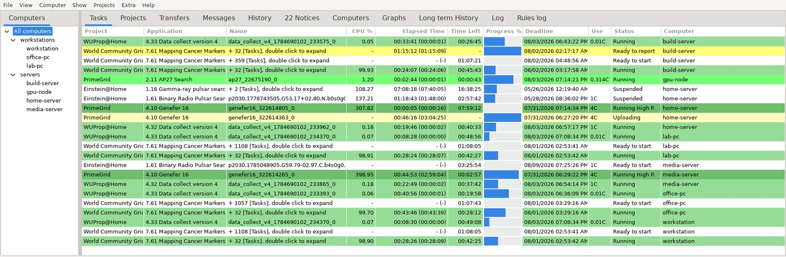
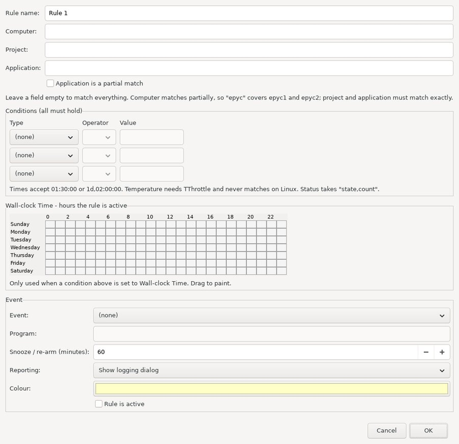

# BoincTasks++

A native port of [BoincTasks](https://efmer.com/boinctasks/) by eFMer — manage
BOINC across every computer you run, from one window. Linux and Windows.

[**Download 0.9.4**](https://github.com/lblanchardiii/boinctasks-pp/releases/latest)

**Linux** — [AppImage](https://github.com/lblanchardiii/boinctasks-pp/releases/download/v0.9.4/BoincTasksPP-0.9.4-x86_64.AppImage)
 · [.deb](https://github.com/lblanchardiii/boinctasks-pp/releases/download/v0.9.4/boinctasks-pp_0.9.4_amd64.deb)
 — **Windows** — [installer](https://github.com/lblanchardiii/boinctasks-pp/releases/download/v0.9.4/BoincTasksPP-0.9.4-setup.exe)
 — [checksums](https://github.com/lblanchardiii/boinctasks-pp/releases/download/v0.9.4/SHA256SUMS)



## What it is

BOINC Manager talks to one client at a time. If you run BOINC on more than a
couple of machines, you spend your day switching between them.

BoincTasks++ shows every client at once and lets you act on any of it: suspend a
task on one host, set no-new-work on a project across all of them, see at a
glance which project has run dry. Tasks, projects, transfers, messages, history
and notices are combined into one view, each row carrying the computer it came
from.

It follows eFMer's Windows application closely on purpose — the same menus, the
same views, the same columns, the same rules engine — so somebody moving from
Windows does not have to relearn anything.

## Status

**0.9.4.** Feature complete against BoincTasks Classic apart from the parts that
are Windows-specific, and in testing. Developed against a farm of 41 clients.

## Install

Everything is on the [releases page](https://github.com/lblanchardiii/boinctasks-pp/releases/latest).

### Linux

Ubuntu 22.04+, Debian 12+, Fedora 36+, RHEL/Rocky/Alma 9+, openSUSE Leap 15.4+ —
anything with glibc 2.34 or newer and GTK 3. x86-64 only for now.

**AppImage** — no installation:

```sh
wget https://github.com/lblanchardiii/boinctasks-pp/releases/download/v0.9.4/BoincTasksPP-0.9.4-x86_64.AppImage
chmod +x BoincTasksPP-0.9.4-x86_64.AppImage
./BoincTasksPP-0.9.4-x86_64.AppImage
```

**Debian / Ubuntu:**

```sh
wget https://github.com/lblanchardiii/boinctasks-pp/releases/download/v0.9.4/boinctasks-pp_0.9.4_amd64.deb
sudo apt install ./boinctasks-pp_0.9.4_amd64.deb
```

### Windows

Windows 10 and 11, 64-bit. Run
[the installer](https://github.com/lblanchardiii/boinctasks-pp/releases/download/v0.9.4/BoincTasksPP-0.9.4-setup.exe) —
it installs to Program Files, adds Start menu entries and registers with
Add/Remove Programs. There is no runtime to install first: the executable is
statically linked, so there is no MSVC redistributable and no DLLs beside it.

It is not code signed, so SmartScreen will warn the first time. Choose **More
info → Run anyway**, or check the SHA256 against the release if you would
rather verify it yourself.

Settings and history go to `%APPDATA%\BoincTasksPP\`, and uninstalling leaves
them alone unless you ask for them to go — reinstalling should not cost you a
list of forty computers.

### Then

Point it at your clients. Any host other than the one you are sitting at
needs `<allow_remote_gui_rpc>1</allow_remote_gui_rpc>` in its `cc_config.xml`
and a password in `gui_rpc_auth.cfg`; **Computer → Find computers** will sweep a
range of addresses and ports for you, which is quicker if you run many clients.

On Linux, settings live in `~/.config/boinctasks-pp.conf` and history in
`~/.config/boinctasks-pp-history.db`. Nothing is written outside your home
directory.

## Building

```sh
sudo apt install build-essential cmake libwxgtk3.2-dev libsqlite3-dev \
                 libssl-dev libexpat1-dev libnotify-dev
cmake -S port -B port/build -DCMAKE_BUILD_TYPE=Release
make -C port/build
```

Release builds are produced in a container, so the result runs on distributions
older than the build host:

```sh
podman build -t bt-build22 -f port/packaging/Containerfile.build22 port/packaging
podman run --rm -e VERSION=0.9.4 \
    -v "$PWD":/src:z \
    -v /opt/appimagetool:/opt/appimagetool:ro \
    -v /usr/local/bin/appimagetool-real:/usr/local/bin/appimagetool-real:ro \
    bt-build22 bash /src/port/packaging/build-release-22.sh
```

`appimagetool` is not baked into the image, so it is mounted in from the host;
without it the AppImage step falls back to a portable tarball. The Windows build
cross-compiles from the same source with MinGW-w64:

```sh
podman build -t bt-win64 -f port/packaging/Containerfile.win64 port/packaging
podman run --rm -e VERSION=0.9.4 -v "$PWD":/src:z bt-win64 \
    bash /src/port/packaging/build-windows.sh
```

That produces `release-windows/BoincTasksPP.exe`. The installer needs `makensis`,
which likewise is not in the image — run it on the host afterwards:

```sh
cd port/packaging/win && makensis -DVERSION=0.9.4 -DVERSION_NUM=0.9.4.0 \
    -DSRCEXE=../../../release-windows/BoincTasksPP.exe \
    -DOUTFILE=../../../release-windows/BoincTasksPP-0.9.4-setup.exe installer.nsi
```

`VERSION_NUM` is separate because Windows version resources take four integers
and nothing else, while `VERSION` may carry a test-build letter — see
[TODO.md](TODO.md) for the versioning scheme. `build-windows.sh` derives it, so
this is only needed when running `makensis` by hand.

That image is Ubuntu 22.04 with wxWidgets 3.2 compiled from source and linked
statically, which puts the runtime floor at glibc 2.34 and leaves the AppImage
with almost nothing to bundle.

## What it does

**Views** — Tasks (grouped, colour coded by status, with progress bars),
Projects, Transfers, Messages, History, Notices, Computers, and graphs for
statistics, tasks over time, data transfer and deadline distribution.

**Operations** — suspend, resume and abort tasks; update, suspend, reset and
detach projects, and set no-new-work; add projects and account managers; edit
BOINC's own preferences, proxy settings and `cc_config.xml`; run benchmarks; set
run, network and GPU modes.

**Rules** — act automatically when a condition is met. A rule matches on
computer, project and application, carries up to three conditions (elapsed time,
CPU %, progress, progress per minute, time left, deadline, use, status,
connection, wall-clock time, project time left) and fires one event (suspend or
resume a project, snooze, snooze GPU, no more work, allow new work, suspend a
task, suspend or resume network, run a program). Every trigger is recorded in
the Rules log.



**Warnings** — highlight what needs attention: tasks approaching their deadline,
and projects that have dropped below a floor of remaining work, filtered by
computer and project.

**Free-DC links** — the Projects tab carries a **Free-DC Host ID** column
showing this host's ID on each project; clicking it opens that host's page on
[Free-DC](https://stats.free-dc.org/). Right-click gives **Free-DC Host CPID**
for the computer's own page. Projects Free-DC does not track are left blank
rather than linked somewhere wrong, and the mapping can be corrected without a
rebuild via `~/.config/boinctasks-pp-freedc.conf`.

## Where it differs from Classic

The port is deliberately faithful, but a few things changed because they had to,
or because they were the reason for building it:

- **Data is merged as it arrives** rather than after every host has answered.
  Waiting for all of them is what lets one unreachable machine freeze the
  display — the problem that started this project.
- **Each client is polled on its own thread**, and the GUI never blocks on RPC,
  so a dead host cannot stall the window or the other clients.
- **Only the visible view is rebuilt.** Monitoring 41 clients and 7,000 tasks
  costs about 5% of one CPU core and 200 MB.
- **History is kept in SQLite** rather than flat files, with a long-term archive
  that retention does not touch.

## Not ported

- **Temperature graph** — reads from TThrottle, which is Windows-only
- **Gadget, Cloud, Mobile** — Windows-specific integrations
- **Toolbars** — every command is on a menu instead
- **Skins and languages**
- A few settings are present but inert; they say so on the tab rather than
  pretending to work

## Credit and licence

BoincTasks is the work of **eFMer (Fred)**, who has developed and supported the
Windows application for years. This port exists because that application is
worth having on Linux, and it follows his design throughout — where the port had
to decide how something should behave, the answer was taken from his source
rather than invented.

Released under the **GPLv3**, the same as the original. See [AUTHORS.md](AUTHORS.md)
for the full breakdown and [CHANGELOG.md](CHANGELOG.md) for the naming history.

`master` holds eFMer's upstream code at the point this forked from it, so
`git diff master...main` shows exactly what the port changed.

## Reporting problems

Include your operating system and version — on Linux, the distribution and
whether you used the AppImage or the `.deb`; on Windows, 10 or 11 — how many
clients you are monitoring, and what you were doing at the time. The **Log** tab
inside the application records connections and every operation, and is usually
the fastest way to see what went wrong.

---

## Original BoincTasks notice

    BoincTasks is a viewer for the Boinc client.

    Copyright (C) 2009-now  eFMer Fred Melgert

    This program is free software: you can redistribute it and/or modify
    it under the terms of the GNU General Public License as published by
    the Free Software Foundation, either version 3 of the License, or
    any later version.

    This program is distributed in the hope that it will be useful,
    but WITHOUT ANY WARRANTY; without even the implied warranty of
    MERCHANTABILITY or FITNESS FOR A PARTICULAR PURPOSE.  See the
    GNU General Public License for more details.

    You should have received a copy of the GNU General Public License
    along with this program (license.html).  If not, see <https://www.gnu.org/licenses/>.
